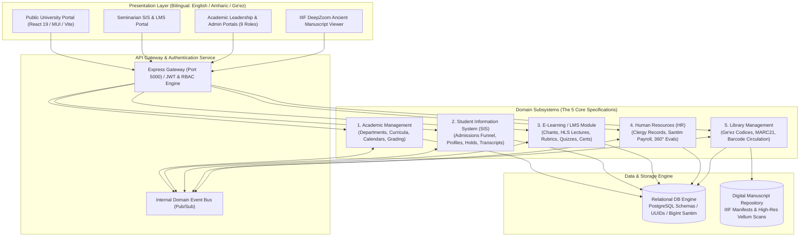

# ✝ Ethiopia Holy Trinity Theology University (HTTU)
## Enterprise Management System (HTTU-EMS) · ዩኒቨርሲቲ ማኔጅመንት ሲስተም

[-10b981?style=for-the-badge&logo=vite)](http://localhost:5173/)
[-d9a621?style=for-the-badge&logo=figma)](http://localhost:5173/)
[](http://localhost:5000/api/health)
[](https://github.com/alualexx/University-HTU)

> **Official Enterprise Management System** for **Ethiopia Holy Trinity Theology University (HTTU)** (`የኢትዮጵያ ቅድስት ሥላሴ ቴዎሎጂ ዩኒቨርሲቲ`).  
> Chartered under imperial patronage and Blessed by the Holy Synod of the Ethiopian Orthodox Tewahedo Church, HTTU is the premier institution of Orthodox theological higher education in the Horn of Africa.

---

## 📑 Table of Contents

- [1. Institutional Overview](#1-institutional-overview)
- [2. System Architecture](#2-system-architecture)
- [3. The 5 Core Subsystems](#3-the-5-core-subsystems)
  - [3.1 Academic Management System](#31-academic-management-system)
  - [3.2 Student Information System (SIS)](#32-student-information-system-sis)
  - [3.3 E-Learning / LMS Module](#33-e-learning--lms-module)
  - [3.4 Human Resources (HR) System](#34-human-resources-hr-system)
  - [3.5 Library Management System](#35-library-management-system)
- [4. The 22 UI Mockup Screens](#4-the-22-ui-mockup-screens)
- [5. Design System & Brand Tokens](#5-design-system--brand-tokens)
- [6. Test Accounts & Personas Directory](#6-test-accounts--personas-directory)
- [7. Installation & Quick Start](#7-installation--quick-start)
- [8. API Reference & Microservice Endpoints](#8-api-reference--microservice-endpoints)
- [9. Repository Structure](#9-repository-structure)

---

## 1. Institutional Overview

Ethiopia Holy Trinity Theology University stands at the intersection of over **1,700 years of unbroken Christian theological tradition** and 21st-century accredited higher education. 

### Mission & Vision
- **Apostolic Fidelity**: Safeguarding the Holy Tradition, Nicene-Constantinopolitan dogma, and Patristic exegesis.
- **Ge'ez & Ancient Heritage**: Conserving rare parchment codices, Biblical texts in Classical Ethiopic, and sacred chant modalities.
- **Ecclesiastical Formation**: Preparing ordained hierarchs, priests, deacons, hymnologists (*Liqawunt*), and lay scholars to serve 50+ million faithful globally.
- **Accreditation**: Fully accredited by the Higher Education Relevance and Quality Agency (HERQA) through 2029 for Bachelor of Theology (BTh) and Master of Divinity (MDiv) degrees.

---

## 2. System Architecture

The HTTU Enterprise Management System is engineered as a domain-driven, microservices-ready platform featuring modular separation, an event bus, precision currency handling, and dual Ethiopian/Gregorian calendar synchronization.



---

## 3. The 5 Core Subsystems

### 3.1 Academic Management System
* **7 Theological Departments**:
  1. **Biblical Studies** (`BIB`): Old & New Testament exegesis, Septuagint, 81-book Orthodox Canon.
  2. **Systematic Theology** (`THEO`): Patristic Christology, Trinitarian dogma, Nicene-Constantinopolitan Creed.
  3. **Church History** (`CHIS`): Universal Church councils, Ethiopian monastic scriptoria, Axumite Nine Saints.
  4. **Pastoral Theology** (`PAST`): Homiletics, parish counseling, diaconal administration, spiritual formation.
  5. **Liturgical Studies** (`LIT`): The 14 Ethiopic Eucharistic Liturgies (Anaphoras), sacramentology, *Fetha Nagast*.
  6. **Church Music & Hymnology** (`CHM`): Sacred musical modes of St. Yared (*Ge'ez*, *Ezel*, *Araray*), *Diggua*, *Tsome Diggua*, *Aquaquam*.
  7. **Ge'ez & Classical Languages** (`GEZ`): Classical Ethiopic syntax, paleography, and translation of ancient parchment manuscripts.
* **Dual Academic Calendar**: Parallel synchronized Ethiopian Calendar (13 months, e.g., *Meskerem 17, 2018 E.C.*) and Gregorian Calendar with liturgical feast integration.
* **Grading & Academic Engine**: Scale $A$ (4.0) to $F$ (0.0), Latin honors, Dean's List ($\ge 3.5$ GPA), and automated GPA recalculation on gradebook sign-off.
* **Tamper-Proof Transcripts**: Cryptographically verifiable transcripts with QR codes and unique verification hashes (`EHTTU-2026-ABC123`).

### 3.2 Student Information System (SIS)
* **Theological Student Identity**: Tracks baptismal names (`የክርስትና ስም`, e.g., *Habte Maryam*), parish church affiliations (`ሰበካ`, e.g., *Holy Trinity Cathedral*), and clergy status (Lay, Deacon, Priest, Monk).
* **Identifier Format**: Standardized institutional ID: `HTTU-YYYY-NNNN` (e.g., `HTTU-2024-01148`).
* **Admissions Funnel**: Multi-stage pipeline (`submitted` $\rightarrow$ `under_review` $\rightarrow$ `interview` $\rightarrow$ `accepted` / `waitlisted` / `rejected`), review desk (`APP-2025-00318`), and document verification.
* **Registration & Hold Governance**: Course enrollment with prerequisite enforcement (minimum grade C- required) and financial lockouts triggered by overdue tuition arrears.

### 3.3 E-Learning / LMS Module
* **Pedagogical Hierarchy**: Course $\rightarrow$ Modules $\rightarrow$ Lessons with conditional unlock prerequisites.
* **St. Yared Sacred Chant Audio Player**: High-fidelity liturgical audio streaming with interactive player, waveform HUD, and simultaneous Ge'ez fidel text, phonetic transliteration, and Amharic translation (*"Zeyewedsuha Mela'ekt"*).
* **Adaptive Video Lecture Player**: HLS multi-bitrate video stream simulation with transcript navigation and automated 90% watch-time requirement to unlock subsequent lessons.
* **Assessment & Rubric Engine**: Exegesis assignment submission with late submission penalty calculation ($\text{score} \times [1 - 0.05 \times \text{days\_late}]$) and three-tier rubrics (Exegesis 40%, Patristic Citations 30%, Orthodoxy 30%).
* **Verifiable Digital Certificates**: Instant completion certificate generation (`CERT-LMS-2026-000142`) signed by the Dean of Academic Affairs and Department Chair.

### 3.4 Human Resources (HR) System
* **Master Clergy Records**: Standardized Employee ID `EMP-YYYY-NNNNNN`, clergy ordination tracking (Deacon, Priest, Hegumen, Archbishop), ordination dates, and parish service details.
* **Precision Santim Compensation**: Stored as integers in *santim* ($1\text{ ETB} = 100\text{ santim}$) to eliminate floating-point precision errors across salary, allowances, and tax withholding.
* **Ethiopian Statutory Leave Categories**: Annual Leave (20 days base + 1 day/year), Sick Leave (30 days), Maternity Leave (120 days paid per Ethiopian Labor Proclamation No. 1156/2019), Paternity Leave (5 days), Sabbatical Leave (180 days), and Church Service Leave (30 days for clergy feasts).
* **360° Multi-Source Performance Evaluations**: Role-weighted scoring ($0.50 \times \text{Supervisor} + 0.20 \times \text{Self} + 0.15 \times \text{Peer} + 0.15 \times \text{Student}$).

### 3.5 Library Management System
* **Rare Manuscripts & Parchment Codices**: Special Collections Ge'ez manuscripts, ancient vellum Tetraevangelions, and MARC21 compliant cataloging.
* **IIIF DeepZoom Viewer**: High-resolution multispectral viewer for digitized manuscripts (`SC MS 0187`).
* **Circulation Rules & Matrix**:
  | Member Classification | Max Items | Loan Period | Renewals | Overdue Rate (Regular) | Overdue Rate (Reserve) |
  | :--- | :---: | :---: | :---: | :---: | :---: |
  | **Seminarians / Students** | 5 | 14 days | 2 | 2 ETB / day | 5 ETB / day |
  | **Faculty Members** | 10 | 30 days | 2 | 2 ETB / day | 5 ETB / day |
  | **University Staff** | 5 | 21 days | 2 | 2 ETB / day | 5 ETB / day |
  | **External Researchers** | 3 | 7 days | 2 | 2 ETB / day | 5 ETB / day |
* **Special Collections Protocol**: Ancient codices are strictly non-circulating and restricted to supervised reading rooms.

---

## 4. The 22 UI Mockup Screens

Every screen from the official UI Mockup Collection has been implemented at 1440px fidelity:

| Screen # | Mockup Plate | Screen Title / Function | Route / Location |
| :---: | :--- | :--- | :--- |
| **01** | Plate 05 | Sign-In & Role Selection (with 8 instant demo pills) | [`/login`](http://localhost:5173/login) |
| **02** | Plate 06 | Registrar Operations Dashboard | [`/registrar-dashboard`](http://localhost:5173/registrar-dashboard) |
| **03** | Plate 07 | Student Dashboard (Daniel Gebremariam) | [`/student-dashboard`](http://localhost:5173/student-dashboard) |
| **04** | Plate 08 | Course Registration & Prerequisite Validation | `/student-dashboard` $\rightarrow$ Registration Tab |
| **05** | Plate 09 | Faculty Gradebook (TH 201 Section 01 Roster) | `/faculty-dashboard` $\rightarrow$ Gradebook Tab |
| **06** | Plate 10 | Invoice Detail & Installment Schedule Modal (`INV-2025-01148`) | `/finance-dashboard` $\rightarrow$ Invoicing Tab |
| **07** | Plate 11 | Employee Profile Modal (`EMP-2026-000123`, Priest status) | `/hr-dashboard` $\rightarrow$ Employee Modal |
| **08** | Plate 12 | Library Catalog & Manuscript Record (`SC MS 0187`) | `/library-dashboard` $\rightarrow$ Catalog Tab |
| **09** | Plate 13 | Student Profile & Deep Navy ID Card (`HTTU24158`) | `/student-dashboard` $\rightarrow$ Profile Tab |
| **10** | Plate 14 | Class Schedule & Weekly Timetable Grid | `/student-dashboard` $\rightarrow$ Timetable Tab |
| **11** | Plate 15 | Grades & Degree Audit (Fall 2024 Final Grades) | `/student-dashboard` $\rightarrow$ Grades Tab |
| **12** | Plate 16 | Student Fees & Invoices (Outstanding ETB 4,850.00) | `/student-dashboard` $\rightarrow$ Finance Tab |
| **13** | Plate 17 | Enterprise IT & Microservices Health Dashboard | [`/admin-dashboard`](http://localhost:5173/admin-dashboard) |
| **14** | Plate 18 | Dean Portal (Rev. Dr. Abeba Zerihun) | [`/dean-dashboard`](http://localhost:5173/dean-dashboard) |
| **15** | Plate 19 | Department Head Dashboard (Dr. Sofia Assefa) | [`/depthead-dashboard`](http://localhost:5173/depthead-dashboard) |
| **16** | Plate 20 | Faculty Dashboard (Dr. Alemeyahu Worku) | [`/faculty-dashboard`](http://localhost:5173/faculty-dashboard) |
| **17** | Plate 21 | Finance Dashboard (Mahlet Yohannes, ETB Analytics) | [`/finance-dashboard`](http://localhost:5173/finance-dashboard) |
| **18** | Plate 22 | HR & Workforce Dashboard (Hanna Bekele) | [`/hr-dashboard`](http://localhost:5173/hr-dashboard) |
| **19** | Plate 23 | Library Circulation Desk (Tsehay Girma, Barcode Scanner) | `/library-dashboard` $\rightarrow$ Circulation Tab |
| **20** | Plate 24 | Registrar Admissions Funnel (1,284 $\rightarrow$ 402 Accepted) | `/registrar-dashboard` $\rightarrow$ Admissions Tab |
| **21** | Plate 03 | Public University Home (Hero, Programs, Intake Card) | [`/`](http://localhost:5173/) |
| **22** | Plate 04 | Public Admissions Overview (Requirements, Tuition, Funnel) | [`/apply`](http://localhost:5173/apply) |

---

## 5. Design System & Brand Tokens

The interface adheres to the institutional design system of Ethiopia Holy Trinity Theology University:

```css
:root {
  --httu-navy:        #0E2033; /* Primary brand & sidebar canvas */
  --httu-gold:        #D9A621; /* Trinity gold accent & badges */
  --httu-teal:        #12808C; /* Secondary brand & liturgical teal */
  --httu-canvas:      #F4F6F8; /* Light neutral application canvas */
  --httu-dark-bg:     #09131F; /* Dark mode root background */
  --httu-card-bg:     #FFFFFF; /* White card surface */
  --httu-border:      #E2E8F0; /* Soft slate border */
  --httu-text-main:   #0E2033; /* Primary typography */
  --httu-text-muted:  #64748B; /* Secondary typography */
}
```

---

## 6. Test Accounts & Personas Directory

Use these active accounts on **[http://localhost:5173/login](http://localhost:5173/login)**. You can also click any of the **Quick Demo Access pills** on the sign-in card to auto-fill credentials:

| Persona | Role | Username | Email | Password | Primary Portal |
| :--- | :--- | :--- | :--- | :--- | :--- |
| **Daniel Gebremariam** | Student | `daniel.g` | `daniel.g@httu.edu.et` | `password123` | Student Dashboard, Registration, ID Card, LMS |
| **Dr. Alemeyahu Worku** | Faculty | `dr.alemeyahu` | `dr.alemeyahu@httu.edu.et` | `password123` | Faculty Dashboard, TH 201 Gradebook |
| **Dr. Sofia Assefa** | Dept Head | `fr.yohannes` | `fr.yohannes@httu.edu.et` | `password123` | Department Head Dashboard (`/depthead-dashboard`) |
| **Rev. Dr. Abeba Zerihun** | Dean | `dean` | `dean@httu.edu.et` | `password123` | Dean Portal (`/dean-dashboard`) |
| **Archbishop Merkorios** | President | `president` | `president@httu.edu.et` | `password123` | Executive Governance Portal |
| **Meskerem Abebe** | Registrar | `registrar` | `registrar@httu.edu.et` | `password123` | Registrar Ops & Admissions Funnel |
| **Mahlet Yohannes** | Finance | `finance` | `finance@httu.edu.et` | `password123` | Finance Dashboard, Invoices & ETB Collections |
| **Hanna Bekele** | HR | `hr` | `hr@httu.edu.et` | `password123` | HR Dashboard, Clergy Profiles, Leave Desk |
| **Tsehay Girma** | Librarian | `librarian` | `librarian@httu.edu.et` | `password123` | Library Circulation & Ge'ez Manuscripts |
| **System Admin** | Admin | `admin` | `admin@httu.edu.et` | `admin123` | IT Security, Health Monitor, Audit Trail |

---

## 7. Installation & Quick Start

### Prerequisites
- **Node.js**: v18.0.0 or later (v20+ recommended)
- **npm**: v9.0.0 or later
- **Git**: Installed and configured

### 1. Clone the Repository
```bash
git clone https://github.com/alualexx/University-HTU.git
cd University-HTU
```

### 2. Install Dependencies
```bash
# Install root dependencies
npm install

# Install client dependencies
cd client
npm install
cd ..

# Install server dependencies
cd server
npm install
cd ..
```

### 3. Run the System

In two terminal windows:

**Terminal 1 — Backend API Gateway:**
```bash
cd server
node server.js
# Runs API Gateway on http://localhost:5000
```

**Terminal 2 — Frontend Web Portal:**
```bash
cd client
npm run dev
# Serves Vite application on http://localhost:5173
```

### 4. Build for Production
```bash
cd client
npm run build
# Compiles to client/dist with 0 warnings or errors
```

---

## 8. API Reference & Microservice Endpoints

| Method | Endpoint | Description |
| :--- | :--- | :--- |
| `GET` | `/api/health` | Gateway health & institutional version status |
| `POST` | `/api/v1/auth/login` | Authenticate with username/email & password |
| `GET` | `/api/v1/auth/demo-users` | Retrieve quick demo accounts |
| `GET` | `/api/departments` | List all 7 theological departments |
| `GET` | `/api/courses` | Retrieve courses with credit hours and Ge'ez titles |
| `GET` | `/api/students` | Query student records |
| `POST` | `/api/applications` | Submit new admission application |
| `GET` | `/api/v1/events/audit` | View system-wide event audit trail |
| `GET` | `/api/v1/library/manuscripts`| Search catalog of ancient Ge'ez manuscripts |

---

## 9. Repository Structure

```text
university-system/
├── client/                           # React 19 Frontend (Vite)
│   ├── src/
│   │   ├── components/               # Navbar, Footer, ProtectedRoute, Modals
│   │   ├── context/                  # AuthContext, ThemeContext, LanguageContext
│   │   ├── pages/
│   │   │   ├── admin/                # IT & System Admin + President Dashboards
│   │   │   ├── dean/                 # Dean Portal (Plate 18)
│   │   │   ├── faculty/              # Faculty & Department Head Dashboards
│   │   │   ├── finance/              # Finance Dashboard & Invoicing Modals
│   │   │   ├── hr/                   # HR Dashboard & Clergy Records
│   │   │   ├── library/              # Library Circulation & Manuscript Viewer
│   │   │   ├── public/               # Public Home, Apply, Courses, Faculty, About
│   │   │   ├── registrar/            # Registrar Ops & Admissions Funnel
│   │   │   └── student/              # Seminarian Portal & E-Learning (LMS)
│   │   ├── services/                 # Axios API connector & Firebase bindings
│   │   └── theme.js                  # HTTU brand color palette tokens
│   └── package.json
├── server/                           # Node.js Express REST API & Domain Engine
│   ├── database/                     # PostgreSQL schemas, DB engine & seedData
│   ├── events/                       # Domain event bus & audit trail logger
│   ├── middleware/                   # JWT authentication & RBAC validator
│   ├── routes/                       # Academic, SIS, LMS, HR, Library, Auth routes
│   ├── utils/                        # Ethiopian calendar & Santim currency helpers
│   ├── server.js                     # Gateway entry point (Port 5000)
│   └── package.json
└── README.md                         # Master Documentation
```

---

## ✝ Institutional Colophon

```text
Ethiopia Holy Trinity Theology University (HTTU)
Addis Ababa, Ethiopia · P.O. Box 1214
Office of the Academic Dean & Central Registrar
Under the Pastoral Patronage of the Holy Synod of the Ethiopian Orthodox Tewahedo Church
```